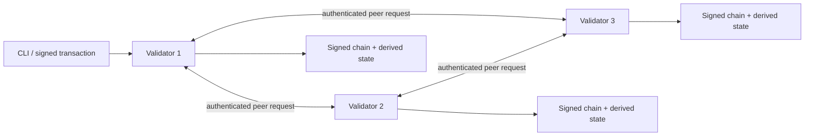

# NOVA

NOVA is an independent blockchain designed for personal, self-hosted use. The current `v0.12.0` release can run three validator nodes on a single Windows computer and generate separately encrypted validator deployment bundles for three independent devices. Accounts and validators use Ed25519 signatures, blocks are committed only after receiving signatures from at least two of the three validators, and every node independently replays transactions and verifies the resulting state root.

This release securely stores encrypted private keys, reports final transaction receipts, diagnoses the health of a three-node network, automatically selects a trustworthy backup source, and provides NOVA's first practical personal-use feature: immutable SHA-256 proofs for local files. A proposer signs its own proposal only after collecting enough valid peer votes. Valid persisted locks can be retried automatically with signed evidence, preventing common liveness failures caused by staggered startup or lost responses. During shutdown, a node first closes HTTP access, drains synchronization, proposal, recovery, and gossip tasks, and releases its node-home lock only after those tasks finish, preventing old and new processes from writing to disk at the same time.

NOVA is still a protocol prototype for learning and validating requirements. **Do not use it to hold real value or expose it directly to the public internet.**

## Recommended setup

NOVA requires Node.js 22 or later. Install the local Explorer dependencies before the first run:

```powershell
npm.cmd run setup
```

Choose a unique, strong password of at least 12 characters and start the encrypted private network:

```powershell
$env:NOVA_KEY_PASSWORD = "replace-with-your-own-strong-password"
npm.cmd run nova:secure
```

On its first run, this command atomically creates three nodes, the genesis configuration, and an encrypted faucet under `.nova/private`. Later runs continue the existing chain. The Explorer is available at [http://localhost:3000](http://localhost:3000), and the node APIs listen on `http://127.0.0.1:4101` through `4103`. Press `Ctrl+C` to stop all services.

The password is never written to disk. Store it in a password manager; if it is lost, the validator and faucet private keys cannot be recovered. For convenience, the single-machine mode encrypts all four private keys with the same startup password. The v0.12 multi-device workflow requires four different passwords: one for the faucet and one for each validator. Validator key rotation is not implemented yet.

## Prepare a three-device network

This workflow creates configuration and encrypted identities that can be separated safely. It does not install a private network automatically or turn the current computer into a public server. Start by creating and editing a public topology template:

```powershell
node src/cli.js network template --out .nova/nova-topology.json
```

Replace the three example `10.99.0.x` addresses with fixed addresses assigned to the three devices inside the same private network overlay. On the initialization computer, set four different passwords of at least 12 characters and generate the network:

```powershell
$env:NOVA_FAUCET_PASSWORD = "strong-password-used-only-for-the-faucet"
$env:NOVA_NODE1_PASSWORD = "strong-password-used-only-for-validator-one"
$env:NOVA_NODE2_PASSWORD = "strong-password-used-only-for-validator-two"
$env:NOVA_NODE3_PASSWORD = "strong-password-used-only-for-validator-three"

node src/cli.js network init `
  --dir .nova/distributed `
  --topology .nova/nova-topology.json

node src/cli.js bundle create --network .nova/distributed --node node1 --out .nova/node1-bundle.json
node src/cli.js bundle create --network .nova/distributed --node node2 --out .nova/node2-bundle.json
node src/cli.js bundle create --network .nova/distributed --node node3 --out .nova/node3-bundle.json
```

Each bundle has a checksum and contains only the shared genesis configuration, that node's configuration, and its single encrypted validator key. It never contains the faucet key or another validator's key. Never install the same bundle on more than one device. See the [three-device deployment guide](docs/DEPLOYMENT.md) for copying, installation, firewall, and backup instructions, and use the [three-device topology example](docs/examples/three-device-topology.json) as an editable reference. Until the three physical devices and private network are ready, use the `nova:secure` single-machine mode for routine personal use.

After all three devices are running, execute signed diagnostics and a remote chain backup from a trusted administration computer that can reach the same private network:

```powershell
node src/cli.js doctor --deployment .nova/distributed
node src/cli.js backup create --deployment .nova/distributed --out .nova/backups/nova.json
node src/cli.js backup verify --file .nova/backups/nova.json
```

A remote backup tolerates one unreachable validator, but it must obtain signed status responses from at least two validators and two complete, replayable chains with shared history. The backup is rejected if an online node returns forged status or if different chain heads appear at the same height.

## Verify the network

Open another PowerShell window, set the same password used to start the single-machine network, and query its status:

```powershell
$env:NOVA_KEY_PASSWORD = "the-same-password-used-at-startup"
node src/cli.js status
npm.cmd run doctor
```

`doctor` verifies the genesis configuration, validator identities, signed blockchains, shared history, password-based key access, and live chain heads across all three nodes. If the network is stopped, it reports a warning but still completes offline validation. It reports an actionable failure when only some nodes are online or when nodes at the same height have different blocks.

Create an encrypted receiving account:

```powershell
node src/cli.js account create --out .nova/alice-keystore.json --label alice
```

Replace `<ALICE_ADDRESS>` with the address printed by the command, then transfer funds from the encrypted faucet:

```powershell
node src/cli.js tx transfer `
  --key .nova/private/faucet-key.json `
  --to <ALICE_ADDRESS> `
  --amount 2500000 `
  --fee 10 `
  --memo "first NOVA transfer"
```

Amounts use integer `unova` units: `1 NOVA = 1,000,000 unova`. After the command returns a transaction ID, query the final receipt and account balance:

```powershell
node src/cli.js tx status --id <TRANSACTION_ID>
node src/cli.js account balance --address <ALICE_ADDRESS>
```

## Create a proof for a local file

The file contents and local path are never uploaded or written to the chain. Only the SHA-256 digest, byte length, and explicitly public metadata enter the signed transaction. This example uses the private-network faucet as the recording account:

```powershell
node src/cli.js record create `
  --key .nova/private/faucet-key.json `
  --file C:\path\to\your-file.pdf `
  --title "My first proof" `
  --category document `
  --note "This note will remain public permanently" `
  --fee 1
```

Verify the original file later:

```powershell
node src/cli.js record verify --file C:\path\to\your-file.pdf
node src/cli.js record list --category document
```

You can also select **Verify local file** at [http://localhost:3000](http://localhost:3000). The Explorer calculates the digest locally in the browser. Use the CLI's streaming verification for files larger than 64 MiB.

A record proves that the signing account committed a digest of those exact bytes no later than the block's recorded time. It does not automatically prove that the content is true, lawful, or original. Titles, categories, notes, file sizes, and raw digests remain visible to every chain participant permanently. Never put secrets in public metadata; hashes of low-entropy sensitive content may also be guessed.

## Development network and tests

`npm.cmd run nova` starts a development network and Explorer with plaintext test keys. Use it only for automated testing and demonstrations. `npm.cmd run demo` executes a three-node transfer in a temporary directory and cleans it up automatically. Use `nova:secure` for routine personal operation.

```powershell
npm.cmd test
npm.cmd run demo
```

## Backup and recovery

A chain backup contains only the genesis configuration and signed blocks. It never contains account or validator private keys:

```powershell
node src/cli.js node verify --home .nova/private/node1
node src/cli.js backup create --network .nova/private --out .nova/backups/nova.json
node src/cli.js backup verify --file .nova/backups/nova.json
```

A network-level backup verifies that every node shares the same history and automatically reads the chain from the highest verified node. It refuses to create a misleadingly successful backup when it detects corruption, configuration errors, or a fork.

After a network has been distributed across separate devices, do not run `--network` against the original initialization directory. Use `--deployment` to retrieve the live chain from the remote nodes. The result is still a `nova-chain-backup` v1 file and works with the same `backup verify` and `backup restore` commands.

Stop the destination node before restoring it. Restore acquires the destination's node-home lock, preventing it from writing alongside a running node:

```powershell
node src/cli.js backup restore --home .nova/private/node1 --file .nova/backups/nova.json
```

Chain backups and private-key backups solve different problems. To recover full ownership, separately back up `.nova/private/*key.json`, personal account keystores, and their passwords in a secure location. See the [secure operations guide](docs/OPERATIONS.md) for detailed procedures.

## Current architecture



- `src/core/`: deterministic protocol logic, cryptography, transactions, blocks, and state transitions.
- `src/runtime/`: genesis initialization, encrypted-key loading, disk persistence, node locks, and backups.
- `src/node.js`: node HTTP networking, transaction propagation, voting, block proposals, and synchronization.
- `src/cli.js`: the operator-facing command-line interface.
- `explorer/`: a live block Explorer that connects only to a local node.
- `test/`: protocol unit tests and three-node end-to-end tests.

## Explicit security boundaries

- The current consensus mechanism is a simplified quorum PoA with a fixed validator set, not formally verified, production-grade BFT.
- Write requests between nodes have Ed25519 authentication, receiver binding, integrity protection, and short-window replay prevention. Multi-device configurations still use plaintext HTTP that must remain inside a private network overlay; they do not provide TLS confidentiality, rate limiting, or denial-of-service protection.
- JSON file storage does not provide database transactions, incremental snapshots, pruning, or mature disaster recovery.
- Record queries currently scan the complete chain. This is suitable for personal-scale use, not large file indexes.
- NOVA has no dynamic validators, governance, smart contracts, cross-chain support, private transactions, or validator key rotation.
- The local Explorer must not be published directly to the internet. Remote access requires a secure, read-only gateway first. v0.12 provides signed remote diagnostics, quorum backups, crash-state cleanup, recovery for common lock states, and graceful shutdown, but the owner has not yet completed acceptance testing on three physical devices.
- `node.lock` prevents two processes from writing to the same node home and recovers locks left by dead process IDs. It is not a distributed lock.

Architecture decisions are recorded in [ADR 0001](docs/adr/0001-node-prototype.md) through [ADR 0012](docs/adr/0012-graceful-node-shutdown.md). See the [product brief](docs/PRODUCT.md), [roadmap](docs/ROADMAP.md), and [protocol summary](docs/PROTOCOL.md) for scope, delivery stages, and protocol formats.

## Project principles

1. Prove practical personal-use scenarios before committing to a more complex technology stack.
2. Keep consensus and state transitions deterministically replayable.
3. Apply a higher security threshold before introducing private keys, real assets, or public deployment.
4. Deliver a runnable, testable, observable, and recoverable result at every stage.
