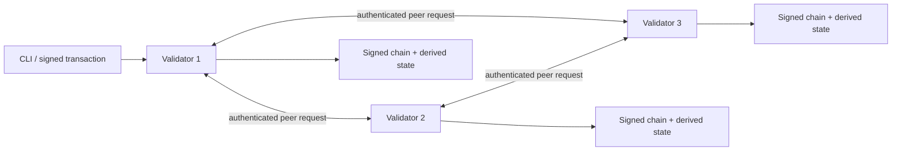

# NOVA

NOVA 是一条面向个人自用场景的独立区块链。当前 `v0.12.0` 可以在一台 Windows 电脑上运行三个验证节点，并能为三台独立设备生成分别加密的验证者部署包：账户和验证者使用 Ed25519 签名，区块至少获得 2-of-3 验证者签名后提交，所有节点独立重放交易并验证状态根。

这一版本已经能安全地保存加密私钥、查询交易最终回执、诊断三节点健康、自动选择可靠备份源，并提供第一项真实自用能力：给本地文件创建不可篡改的 SHA-256 链上存证。提议者只有取得足够的有效同伴票后才自签，合法持久化锁可带签名证明自动重试，避免常见错峰启动和响应丢失导致停链。停止节点时会先关闭 HTTP、排空同步/出块/恢复/gossip 后台任务，最后才释放 home 锁，避免新旧实例交叠写盘。它仍是学习和需求验证阶段的协议原型，**不能承载真实价值，也不能直接暴露到公网**。

## 推荐启动方式

需要 Node.js 22 或更高版本。首次使用先安装本地浏览器依赖：

```powershell
npm.cmd run setup
```

设置一个至少 12 位且唯一的密码，再启动加密私人网络：

```powershell
$env:NOVA_KEY_PASSWORD = "请换成你自己的高强度密码"
npm.cmd run nova:secure
```

首次运行会在 `.nova/private` 原子创建三个节点、创世文件和加密水龙头；以后运行同一命令会继续已有链。浏览器地址是 [http://localhost:3000](http://localhost:3000)，节点 API 是 `http://127.0.0.1:4101` 至 `4103`。按 `Ctrl+C` 停止全部服务。

密码不会写入磁盘。请把它保存在密码管理器中；丢失密码就无法恢复验证者和水龙头私钥。这个便捷单机模式的四把私钥共用启动密码；v0.12 多设备模式会强制水龙头和三个验证者使用四个不同密码。验证者密钥轮换仍未实现。

## 准备三设备网络

这一步只生成可安全拆分的配置和加密身份，不会自动安装私网，也不会把当前电脑变成公网服务器。先创建并编辑公开拓扑模板：

```powershell
node src/cli.js network template --out .nova/nova-topology.json
```

把三个示例 `10.99.0.x` 地址改成三台设备在同一私网覆盖中的固定地址。然后在初始化电脑上设置四个彼此不同、至少 12 位的密码环境变量，再生成网络：

```powershell
$env:NOVA_FAUCET_PASSWORD = "只属于水龙头的高强度密码"
$env:NOVA_NODE1_PASSWORD = "只属于节点一的高强度密码"
$env:NOVA_NODE2_PASSWORD = "只属于节点二的高强度密码"
$env:NOVA_NODE3_PASSWORD = "只属于节点三的高强度密码"

node src/cli.js network init `
  --dir .nova/distributed `
  --topology .nova/nova-topology.json

node src/cli.js bundle create --network .nova/distributed --node node1 --out .nova/node1-bundle.json
node src/cli.js bundle create --network .nova/distributed --node node2 --out .nova/node2-bundle.json
node src/cli.js bundle create --network .nova/distributed --node node3 --out .nova/node3-bundle.json
```

每个 bundle 都有校验和，只含共同创世配置、本节点配置和本节点的一把加密私钥，不含水龙头或其他验证者私钥。不要把同一个 bundle 安装到两台设备。完整复制、安装、防火墙和备份步骤见 [三设备部署手册](docs/DEPLOYMENT.md)，可编辑拓扑见 [三设备示例](docs/examples/three-device-topology.json)。在三台真实设备和私网准备好之前，日常自用继续采用上面的 `nova:secure` 单机模式。

三台设备启动后，在能访问同一私网的受信任管理电脑上执行签名诊断和远程链备份：

```powershell
node src/cli.js doctor --deployment .nova/distributed
node src/cli.js backup create --deployment .nova/distributed --out .nova/backups/nova.json
node src/cli.js backup verify --file .nova/backups/nova.json
```

远程备份允许三台中的一台不可达，但必须取得至少两个验证者的有效签名状态和两份完整、可重放、共享历史的链。任何在线节点返回伪造状态，或相同高度出现不同链头时都会拒绝备份。

## 验证网络

另开一个 PowerShell 窗口并设置同一密码，然后查询状态：

```powershell
$env:NOVA_KEY_PASSWORD = "与启动时相同的密码"
node src/cli.js status
npm.cmd run doctor
```

`doctor` 会校验三个节点的创世配置、验证者身份、签名区块链、共同历史、密码解锁和在线链头。网络停止时会给出警告但继续完成离线验证；部分节点在线或相同高度出现不同区块时会判定需要处理。

创建一个加密接收账户：

```powershell
node src/cli.js account create --out .nova/alice-keystore.json --label alice
```

将命令输出的地址替换到 `<ALICE_ADDRESS>`，从加密水龙头转账：

```powershell
node src/cli.js tx transfer `
  --key .nova/private/faucet-key.json `
  --to <ALICE_ADDRESS> `
  --amount 2500000 `
  --fee 10 `
  --memo "first NOVA transfer"
```

金额使用整数 `unova`，`1 NOVA = 1,000,000 unova`。命令返回交易 ID 后可查询最终回执：

```powershell
node src/cli.js tx status --id <TRANSACTION_ID>
node src/cli.js account balance --address <ALICE_ADDRESS>
```

## 给本地文件创建存证

文件内容和本地路径不会上传或写入链；只有 SHA-256、字节数和你填写的公开元数据进入签名交易。以下示例使用私人网络水龙头作为记录者：

```powershell
node src/cli.js record create `
  --key .nova/private/faucet-key.json `
  --file C:\path\to\your-file.pdf `
  --title "My first proof" `
  --category document `
  --note "这段备注会永久公开" `
  --fee 1
```

以后用原文件验证：

```powershell
node src/cli.js record verify --file C:\path\to\your-file.pdf
node src/cli.js record list --category document
```

也可以在 [http://localhost:3000](http://localhost:3000) 点击“验证本地文件”。浏览器只在本地计算哈希；超过 64 MiB 的文件使用 CLI 流式验证。

存证证明的是“该签名账户最迟在提交区块的时间记录了这组精确字节”，不自动证明内容真实、合法或原创。标题、分类、备注、文件大小和裸哈希对所有链参与者永久可见；不要填写秘密，低熵敏感内容的哈希也可能被猜测。

## 测试开发网

`npm.cmd run nova` 会启动使用明文测试密钥的开发网和浏览器，只适合自动化测试与演示。`npm.cmd run demo` 会在临时目录完成一笔三节点转账后自动清理。日常自用请使用 `nova:secure`。

```powershell
npm.cmd test
npm.cmd run demo
```

## 备份与恢复

链备份只包含创世配置与经过签名的区块，不包含任何账户或验证者私钥：

```powershell
node src/cli.js node verify --home .nova/private/node1
node src/cli.js backup create --network .nova/private --out .nova/backups/nova.json
node src/cli.js backup verify --file .nova/backups/nova.json
```

网络级备份会验证全部节点共享同一条历史，并自动从最高的已验证节点读取链。发现损坏、配置错误或分叉时会拒绝生成看似成功的备份。

已经分布到不同设备的网络不能再用初始化目录执行 `--network`；应使用 `--deployment` 从远端节点取得实时链。生成的仍是同一种 `nova-chain-backup` v1 文件，可用相同的 `backup verify` 和 `backup restore` 命令处理。

恢复前必须停止目标节点。恢复操作会取得同一个节点目录锁，因此不会与运行中的节点同时写盘：

```powershell
node src/cli.js backup restore --home .nova/private/node1 --file .nova/backups/nova.json
```

链备份与私钥备份是两件事。要恢复完整所有权，必须另外安全备份 `.nova/private/*key.json`、自己的账户 keystore 和密码。详细步骤见 [安全运维手册](docs/OPERATIONS.md)。

## 当前架构



- `src/core/`：确定性协议、密码学、交易、区块和状态转换。
- `src/runtime/`：创世初始化、加密密钥加载、磁盘持久化、节点锁和备份。
- `src/node.js`：节点 HTTP 网络、交易传播、投票、出块和同步。
- `src/cli.js`：面向操作者的命令行入口。
- `explorer/`：只连接本机节点的实时区块浏览器。
- `test/`：协议单元测试和三节点端到端测试。

## 明确的安全边界

- 当前共识是固定验证者集合的简化 quorum PoA，不是经过形式化验证的生产级 BFT。
- 写入型节点通信具有 Ed25519 请求认证、接收者绑定、完整性和短时重放保护；多设备配置仍使用必须置于私网覆盖内的明文 HTTP，没有 TLS 保密性、限流或抗拒绝服务保护。
- JSON 文件存储没有数据库事务、增量快照、裁剪或成熟灾难恢复能力。
- record 查询当前会扫描完整链，适合个人规模，不适合海量文件索引。
- 没有动态验证者、治理、智能合约、跨链、隐私交易或验证者密钥轮换。
- 本地浏览器不能发布到公网；远程使用必须先增加安全只读网关。v0.12 已提供签名远程诊断、quorum 备份、崩溃状态清理、常见锁恢复与优雅停机，但尚未完成所有者真实三设备部署验收。
- `node.lock` 防止同一目录被两个进程同时写入，并能恢复已死亡 PID 留下的锁，但它不是分布式锁。

架构决策见 [ADR 0001](docs/adr/0001-node-prototype.md) 至 [ADR 0012](docs/adr/0012-graceful-node-shutdown.md)。产品范围见 [产品简报](docs/PRODUCT.md)，阶段计划见 [路线图](docs/ROADMAP.md)，协议格式见 [协议摘要](docs/PROTOCOL.md)。

## 项目原则

1. 先证明真实自用场景，再决定复杂技术栈。
2. 共识和状态转换必须可以确定性重放。
3. 私钥、真实资产和公网部署必须采用比原型更高的安全门槛。
4. 每个阶段都要交付可运行、可测试、可观察、可恢复的结果。
